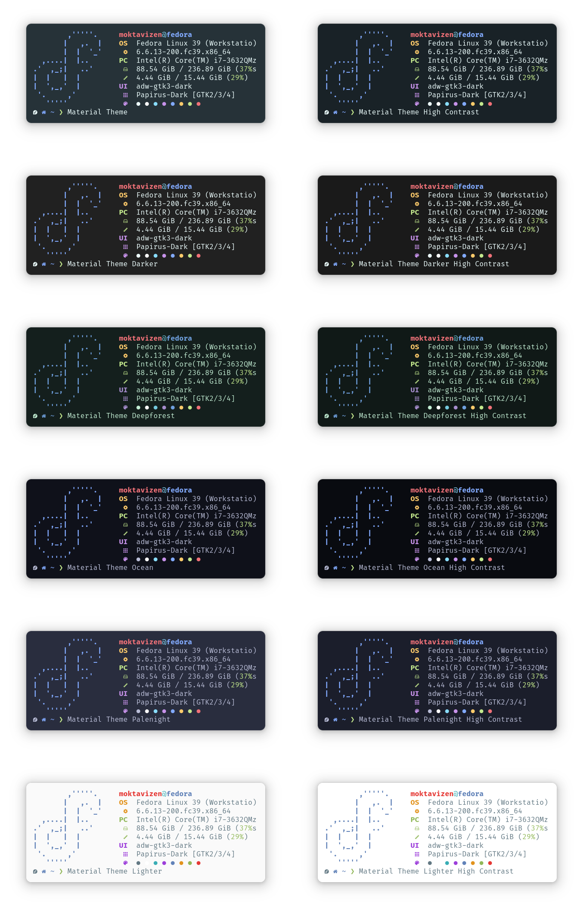

# Material Theme Blackbox

Material [Black Box](https://gitlab.gnome.org/raggesilver/blackbox) color scheme ported from VS Code [Material Theme](https://github.com/material-theme/vsc-material-theme).

## ⚙️ Installation

1. Run `git clone https://github.com/moktavizen/material-blackbox.git`
2. Open Black Box, go to `Menu > Preferences > Terminal > Theme > Click the folder icon`
3. Copy your preferred variant from the `src` folder and paste it into the folder that was opened in step 2.
4. Restart Black Box and select theme from `Menu > Preferences > Terminal > Theme`

## 🎨 Variants

> [!NOTE]
> High Contrast variants provide background with more contrast.