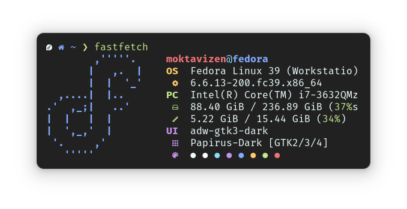

# Material Theme Blackbox

## Installation

1. Run `git clone https://github.com/moktavizen/material-blackbox.git`
2. Open Black Box, go to `Menu > Preferences > Terminal > Theme > Click the folder icon`
3. Select the `themes` folder from this repository.

## Available Variant

### 1. Material Darker

>[!NOTE]
>More Material Theme variant coming soon.